# Cómo añadir un campo personalizado de emparejamiento en Azure DevOps User Stories

Este documento describe los beneficios de añadir un campo personalizado de tipo Identidad en las historias de usuario de Azure DevOps, los requisitos previos y una guía paso a paso.

## Beneficios de añadir un campo personalizado

Tener los nombres de los dos individuos que se emparejan en una historia visibles en las tarjetas de Azure DevOps puede ser útil durante las ceremonias de sprint y conducir a una mayor responsabilidad por parte del asignado de emparejamiento. Durante la daily también puede ayudar al líder del proceso a filtrar las historias asignadas al individuo (tanto como propietario o como asignado al emparejamiento) y mostrarlas en el tablero. Además, el campo de emparejamiento puede proporcionar un punto de datos adicional para los informes y las tasas de burndown.

## Requisitos previos

Antes de personalizar Azure DevOps, revisa [Configurar y personalizar Azure Boards](https://docs.microsoft.com/en-us/azure/devops/boards/configure-customize?view=azure-devops&tabs=agile-process).
Para añadir un campo personalizado a las historias de usuario en Azure DevOps, los cambios deben realizarse como una configuración organizativa.

### Cambiar la configuración de la organización

1. Duplique el proceso actualmente en uso. Para eso vaya a Vaya a **Organization Settings**.
   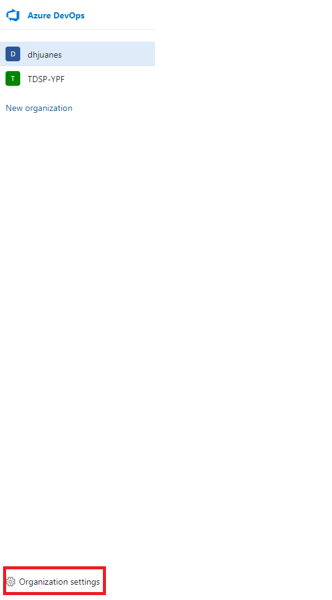
2. Seleccione **Process**, haga clic en el icono con tres puntos **...** y haga clic en **Create inherited process**.
   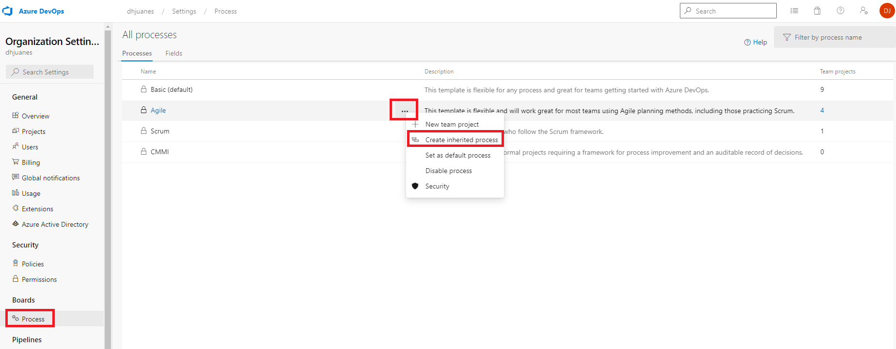
3. Tipee 'Pairing' como nombre y luego haga clic en **Create process**.
4. Haga clic en el proceso heredado recién creado.
5. Haga clic en el tipo de elemento de trabajo User History.
   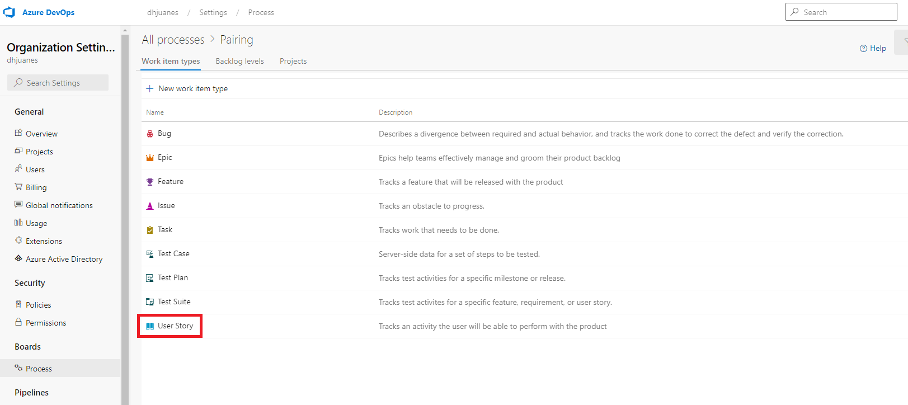
6. Haga clic en New field.
   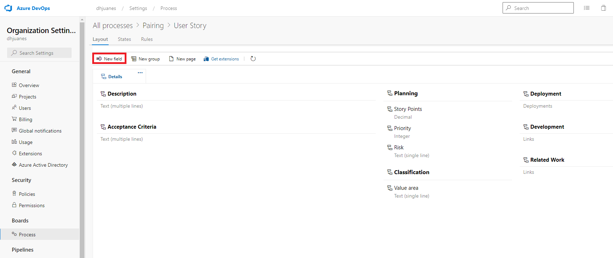
7. Déle un nombre y seleccione **Identity** en Tipo. Haga clic en **Add Field**.
   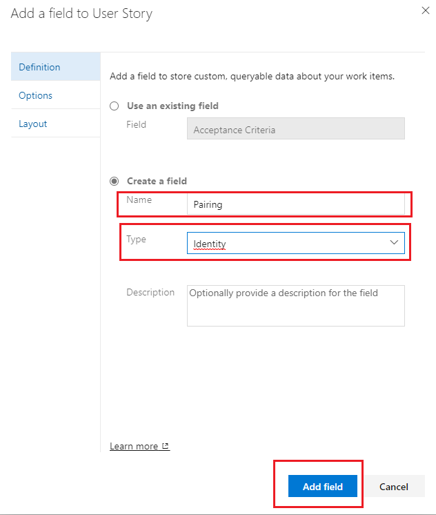

### Modificar la configuración del proyecto

1. Vaya al proyecto que va a modificar, seleccione **Project Settings**.
   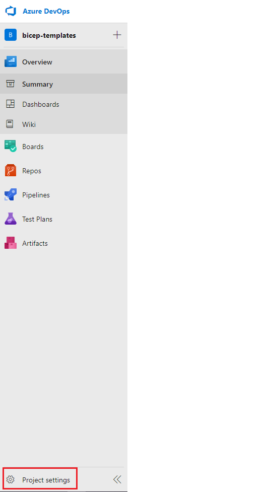
2. Seleccione **Project configuration** y luego en **process customization page**.
   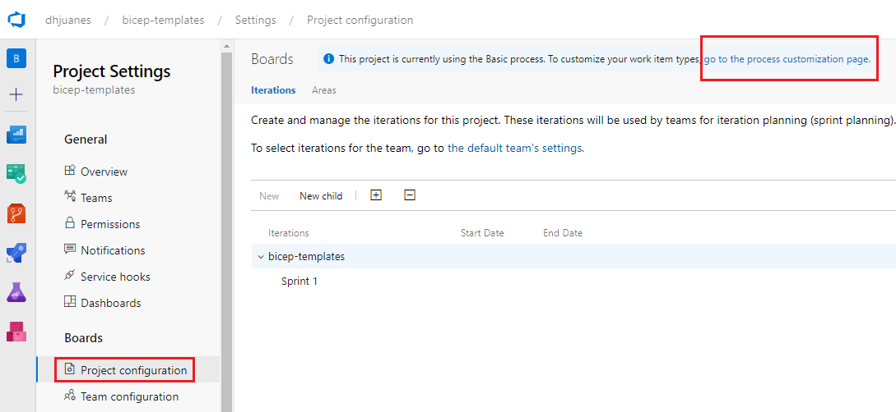
3. Haga clic en **Projects** y luego en **Change process**.
   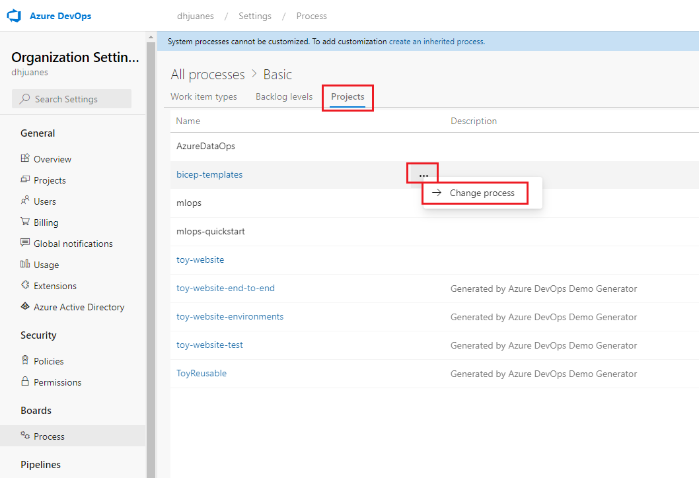
4. Cambie el proceso de destino a Pairing y luego haga clic en **Save**.
   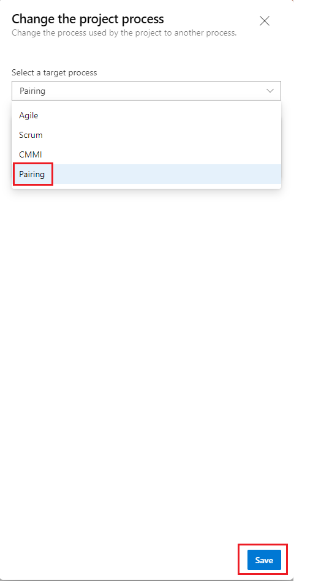
5. Vaya a **Boards** y haga clic en el icono del engranaje para abrir la configuración.
   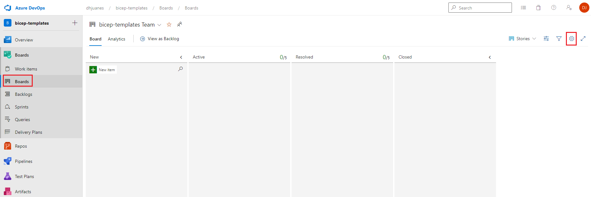
6. Añada el campo a la tarjeta. Haga clic en el icono + para añadir el campo Emparejamiento. Marque la casilla para que se muestren los campos, aunque estén vacíos. **Save and close**.
   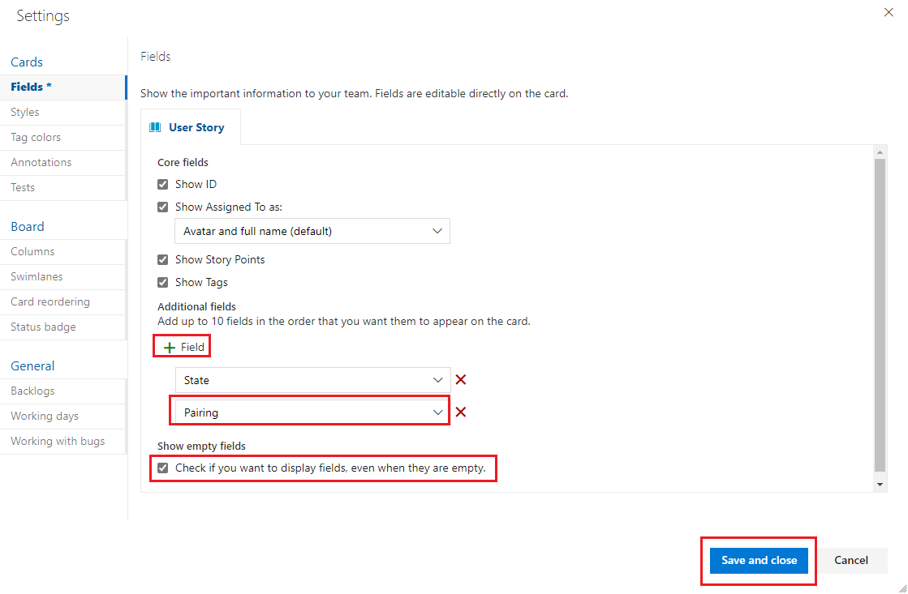
7. Ahora se puede asignar a la Historia un Propietario y un Asignado de emparejamiento.
   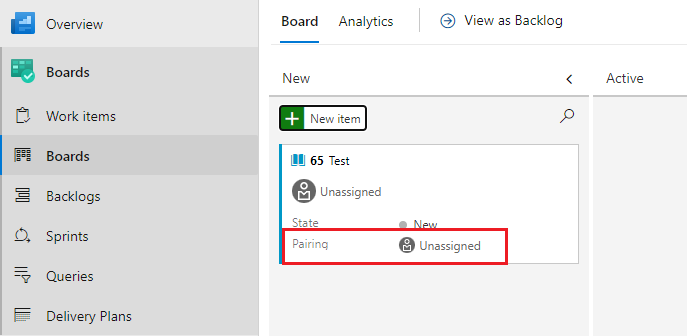
