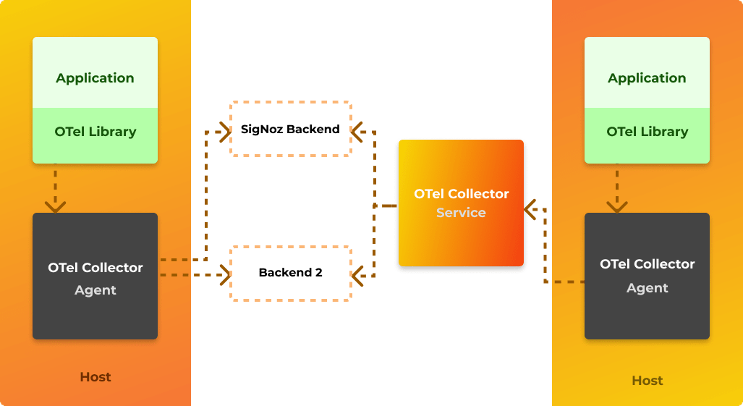

# Open Telemetry

OpenTelemetry es un estándar de observabilidad de código abierto que define cómo generar, recopilar y describir la telemetría en sistemas distribuidos. OpenTelemetry también proporciona una distribución de punto único de un conjunto de API, SDK y bibliotecas de instrumentación que implementa el estándar de código abierto, que puede recopilar, procesar y orquestar datos de telemetría (señales) como trazas, métricas y logs. Admite múltiples lenguajes populares. Un punto importante a tener en cuenta es que OpenTelemetry no tiene su propio backend; toda la telemetría recopilada por OpenTelemetry Collector debe enviarse a un backend como Prometheus, Jaeger, Zipkin, Azure Monitor, etc.
Los dos problemas principales que resuelve OpenTelemetry son: primero, la neutralidad del proveedor para las APIs de tracing, monitoreo y logging y, en segundo lugar, la implementación de propagación de contexto multiplataforma lista para usar para el seguimiento distribuido de extremo a extremo sobre componentes heterogéneos.

## Conceptos básicos de Open Telemetry

### Patrones de implementación de Open Telemetry

Comprender los patrones de implementación básicos lo ayudará a saber qué enfoque se adapta mejor al escenario que está tratando de resolver. Hay tres patrones principales:

* Telemetría automática: la compatibilidad con la instrumentación automática está disponible para algunos lenguajes. Para aquellos disponibles, la instrumentación automatizada de OpenTelemetry se implementa mediante la ejecución de OpenTelemetry Agent. El agente se implementaría con su servicio y se ejecutaría como un proceso separado o en un sidecar. El agente lee un conjunto de variables de entorno predefinidas que se utilizan para configurar su comportamiento y varias configuraciones de exportador/recopilador. El agente interceptará todas las interacciones y dependencias y enviará automáticamente la telemetría a los exportadores configurados.
* Rastreo manual: esto se debe hacer codificando con el SDK de OpenTelemetry, administrando los objetos tracer para obtener intervalos y formando ámbitos de OpenTelemetry instrumentados para identificar los segmentos de código que se rastrearán manualmente.
* Enfoque híbrido: la mayoría de los escenarios listos para producción requerirán una combinación de ambas técnicas, utilizando OpenTelemetry Agent para recopilar telemetría automática y OpenTelemetry SDK para identificar segmentos de código que son importantes para instrumentar manualmente. Este enfoque permite una cobertura completa de toda la solución.

### Collector

El collector es un proceso separado que está diseñado para ser un "sumidero" para los datos de telemetría emitidos por muchos procesos, que luego pueden exportar esos datos a los sistemas de back-end. El collector tiene dos estrategias de implementación diferentes: se ejecuta como un agente junto con un servicio o como una aplicación remota. En general, se recomienda usar ambos: el agente se implementaría con su servicio y se ejecutaría como un proceso separado o en un sidecar; mientras tanto, el recopilador se implementaría por separado, como su propia aplicación ejecutándose en un contenedor o máquina virtual. Cada agente enviaría datos de telemetría al recopilador, que luego podría exportarlos a una variedad de sistemas de back-end como Lightstep, Jaeger o Prometheus.

### Bibliotecas de instrumentación

Una biblioteca que permite la observabilidad de otra biblioteca se denomina biblioteca de instrumentación. Las bibliotecas de OpenTelemetry son específicas del lenguaje, actualmente hay un buen soporte para Java, Python, Javascript, dotnet y golang. El soporte para la instrumentación automática está disponible para algunas bibliotecas que hacen que el uso de OpenTelemetry sea fácil y trivial. En caso de que la instrumentación automática no esté disponible, la instrumentación manual se puede configurar mediante el SDK de OpenTelemetry.

## Integración de OpenTelemetry

OpenTelemetry se puede utilizar para recopilar, procesar y exportar datos a múltiples backends. Algunas integraciones populares compatibles con OpenTelemetry son:

* Zipkin
* Prometheus
* Jaeger
* New Relic
* Azure Monitor
* AWS X-Ray
* Datadog
* Kafka
* Lightstep
* Splunk
* GCP Monitor

## Por qué usar OpenTelemetry

La razón principal es que ofrece un estándar de código abierto para implementar telemetría distribuida (propagación de contexto) en sistemas heterogéneos.

Evitar cualquier bloqueo de propiedad y lograr la neutralidad independiente del proveedor permite patrones máximos de portabilidad y extensibilidad.
Además, OpenTelemetry se rige por especificaciones y está respaldado por grandes actores en el panorama de la observabilidad como Microsoft, Splunk, AppDynamics, etc. Es probable que OpenTelemetry se convierta en un estándar de facto.

## Estado actual del proyecto OpenTelemetry

OpenTelemetry es un proyecto que surgió de la fusión de OpenCensus y OpenTracing en 2019. Aunque OpenCensus y OpenTracing están congelados y no se están desarrollando nuevas funciones para ellos, OpenTelemetry tiene compatibilidad con versiones anteriores de OpenCensus y OpenTracing. Algunas funciones de OpenTelemetry todavía están en versión beta, la compatibilidad de funciones para diferentes lenguajes se rastrea aquí: [Feature Status of OpenTelemetry](https://github.com/open-telemetry/opentelemetry-specification/blob/main/spec-compliance-matrix.md). El estado del proyecto OpenTelemetry se puede rastrear [aquí](https://opentelemetry.io/status/).

## Opciones de integración con Azure Monitor

Hay dos enfoques posibles al integrar una aplicación instrumentada de OpenTelemetry con Azure Monitor como un exportador de OpenTemetry.

### Uso de la biblioteca de exportación de OpenTelemetry de Azure Monitor

Este escenario usa el SDK de OpenTelemetry como la biblioteca de instrumentación principal. Básicamente, esto significa que instrumentará su aplicación con las bibliotecas de OpenTelemetry, pero además usará Azure Monitor OpenTelemetry Exporter y luego lo agregará como un exportador adicional con OpenTelemetry SDK.

### Uso del archivo Jar del agente de Application Insights

Al configurar esta opción, el archivo del Agente de Applications Insights se agrega al ejecutar la aplicación. El archivo de configuración `applicationinsights.json` también debe agregarse como parte de los artefactos de aplicaciones. Preste mucha atención a la sección de vista previa, donde la propiedad `"openTelemetryApiSupport": true`, se establece en true, lo que permite al agente interceptar la telemetría de OpenTelemetry creada en el código de la aplicación y enviarla a Azure Monitor.
La principal diferencia entre ejecutar el agente de OpenTelemetry y el agente de Application Insights se demuestra en la cantidad de trazas que se registran en Azure Monitor. Cuando se ejecuta en modo solo OpenTelemetry, se envían solo las trazas manuales. Por otro lado, cuando se ejecuta utilizando el modo de agente de Application Insights, es fundamental resaltar que no se registra nada en Jaeger (ni en ningún otro exportador de OpenTelemetry). Todas las trazas se enviarán exclusivamente a Azure Monitor.

### Resumen

No existe un enfoque de "talla única" al implementar OpenTelemetry con Azure Monitor como back-end. En el momento de escribir este artículo, si desea tener la flexibilidad de tener diferentes back-ends de OpenTelemetry, definitivamente debe optar por OpenTelemetry Agent, aunque sacrificaría todo el flujo de tracing automático a Azure Monitor. Por otro lado, si desea obtener lo mejor de Azure Monitor y aún desea instrumentar su código con OpenTelemetry SDK, debe usar Application Insights Agent e instrumentar manualmente su código con OpenTelemetry SDK para obtener lo mejor de ambos mundos. De cualquier manera, instrumentar su código con OpenTelemetry parece el enfoque correcto ya que el ecosistema solo se hará más grande, mejor y más robusto.

## Referencias

* [Sitio oficial OpenTelemetry](https://opentelemetry.io/)
* [Primeros pasos con dotnet y OpenTelemetry](https://opentelemetry.io/docs/net/getting-started/)
* [Uso de OpenTelemetry Collector](https://opentelemetry.io/docs/collector/getting-started/)
* [OpenTelemetry Java SDK](https://github.com/open-telemetry/opentelemetry-java)
* [Agente de instrumentación OpenTelemetry para Java](https://github.com/open-telemetry/opentelemetry-java-instrumentation)
* [Agente Java de Application Insights](https://docs.microsoft.com/en-us/azure/azure-monitor/app/java-in-process-agent)
* [Biblioteca cliente de Azure Monitor OpenTelemetry Exporter para Java](https://github.com/Azure/azure-sdk-for-java/tree/3f31d68eed6fbe11516ca3afe3955c8840a6e974/sdk/monitor/azure-monitor-opentelemetry-exporter)
* [Biblioteca de complementos de Azure OpenTelemetry Tracing para Java](https://github.com/Azure/azure-sdk-for-java/tree/main/sdk/core/azure-core-tracing-opentelemetry)
* [Configuración de OpenTelemetry del agente de Application Insights](https://github.com/microsoft/ApplicationInsights-Java/wiki/OpenTelemetry-API-support-(3.0))
